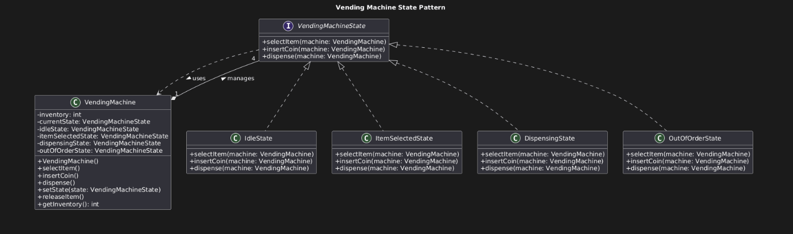

# 🧠 State Pattern – Vending Machine

## 📌 Problem Overview

A vending machine must manage multiple operational states, each with different rules:

* **Idle**
* **ItemSelected**
* **Dispensing**
* **OutOfOrder**

Each state controls which actions are allowed, such as selecting items, inserting coins, or dispensing products. The vending machine also maintains attributes like **item inventory** and **balance**.

---

## ❌ Current System Limitation

The current system relies on **conditional statements** inside the `VendingMachine` class to determine what actions are allowed based on the current state.

As the number of states and rules increases, this approach becomes:

* Hard to maintain
* Error‑prone
* Difficult to extend or modify

---

## ✅ Solution: Apply the State Pattern

The **State Pattern** allows an object to alter its behavior when its internal state changes. Instead of using conditionals, each state is represented by a separate class that encapsulates its own behavior.

This design:

* Improves maintainability
* Encourages clean separation of concerns
* Makes adding new states easier

---

## 🏗️ State Rules and Responsibilities

### 💤 Idle State

* ✔ Item selection is allowed
* ✖ Coin insertion is not allowed
* ✖ Dispensing is not allowed

### 🎯 ItemSelected State

* ✔ Coin insertion is allowed
* ✔ Dispensing is allowed
* ✖ Item selection is not allowed

### 🚚 Dispensing State

* ✖ No operations are allowed
* 🔄 Automatically transitions back to **Idle** after dispensing is complete

### 🚫 OutOfOrder State

* ✖ All operations are disallowed

---

## 🧩 Design Overview

### State Interface

All vending machine states implement a common interface that defines the allowed actions. This ensures consistent behavior across states while allowing each state to enforce its own rules.

### Concrete State Classes

Separate classes are created for:

* IdleState
* ItemSelectedState
* DispensingState
* OutOfOrderState

Each class:

* Handles only the behavior relevant to its state
* Rejects invalid operations
* Manages transitions to other states when needed

### VendingMachine (Context)

The `VendingMachine` class:

* Maintains a reference to the current state
* Stores shared data such as balance and inventory
* Delegates all actions to the current state object

State‑specific logic is completely removed from this class.

---

## 🖼️ UML Diagram

📷 **UML Diagram – State Pattern for Vending Machine**

> 
>
> * `VendingMachine` holding a reference to `VendingMachineState`
> * `IdleState`, `ItemSelectedState`, `DispensingState`, and `OutOfOrderState` implementing the state interface
> * State transitions between the concrete states

---

## ✨ Benefits of Using the State Pattern

* Eliminates complex conditional logic
* Makes the system easier to extend
* Improves readability and maintainability
* Clearly models real‑world state transitions

---

## 📎 Summary

By applying the **State Pattern**, the vending machine becomes more flexible, scalable, and easier to manage. Each state encapsulates its own behavior, allowing the system to grow without increasing complexity in the core `VendingMachine` class.
